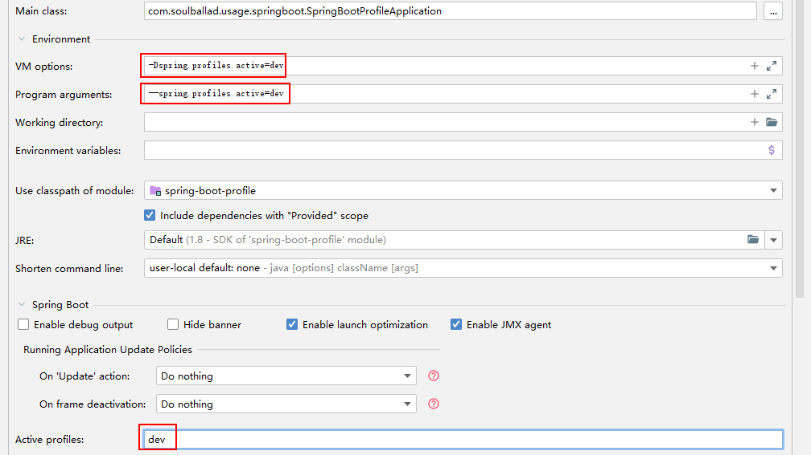

profile 的激活方式
1. 使用 jar 包启动时，指定为命令行参数
   ```shell
   java -jar spring-boot-profile-0.0.1-SNAPSHOT.jar --spring.profiles.active=dev
   ```
2. 使用 jar 包启动时，指定为启动参数
   ```shell
   java -Dspring.profiles.active=dev -jar spring-boot-profile-0.0.1-SNAPSHOT.jar
   ```
3. 通过配置文件指定
   ```properties
   spring.profiles.active=dev
   ```
4. 通过代码设定为系统变量
   ```java
   System.setProperty("spring.profiles.active", "dev");
   ```
5. 启动类中指定
   ```java
   new SpringApplicationBuilder(SpringBootProfileApplication.class)
                   .properties("spring.profiles.active=dev").run(args);
   ```
6. idea 启动时指定（配置任意一处即可）
   
   
7. web.xml 中配置
   ```xml
   <context-param> 
       <param-name>spring.profiles.active</param-name> 
       <param-value>dev</param-value> 
   </context-param>
   ```

