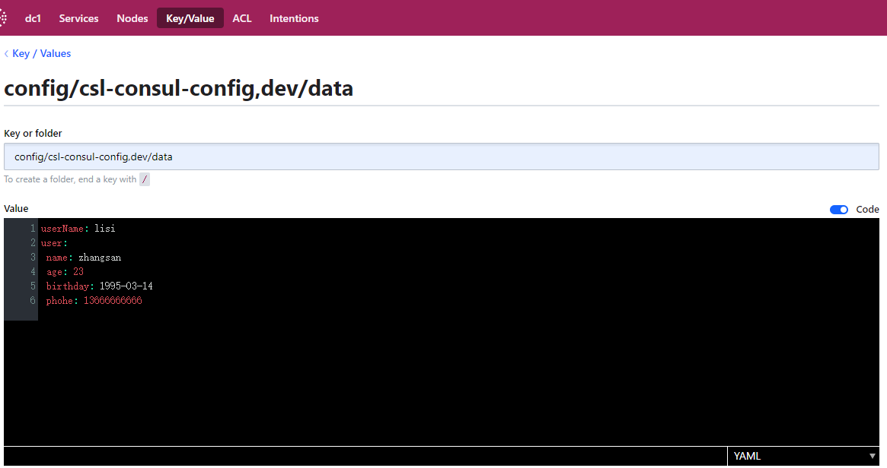

```properties
config/csl-consul-config,dev/data
```
```yaml
userName: lisi
user: 
 name: zhangsan
 age: 23
 birthday: 1995-03-14
 phohe: 13666666666
```
注册中心配置示例：

配置说明：
1. 默认情况下，consul 配置默认存储在 /config 文件夹中；
2. csl-consul-config 为 `spring.application.name` 值，dev 为 `spring.profiles.active` 值，data 为 `data-key` 值；
3. value 用的是 yaml 格式的配置，冒号后面有一个空格；
4. 以上配置都在 `bootstrap.properties` 中声明；
5. 配置调用结果，参考 `spring-cloud-csl-config.http`；
6. 有一个点需要注意，通过 @Value 注入的属性，修改 consul 的配置后，属性不能立即生效，需要服务重启。而通过 @ConfigurationProperties 注入的属性，修改consul的配置后，属性会立即生效，所以建议如果需要动态生效的配置，最好使使用 @ConfigurationProperties 进行属性的注入。